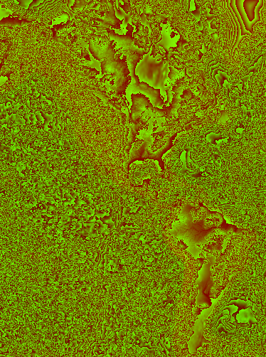
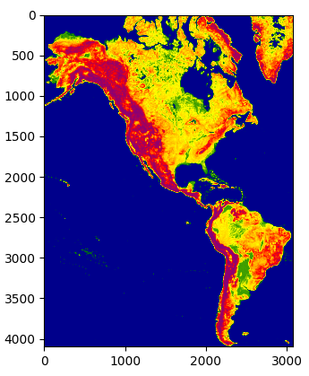

# AWS Project

## Table of Contents

1. [About The Project](#about-the-project)
    - [Aim of the Project](#aim-of-the-project)
    - [Technical Architecture](#technical-architecture)
    - [Tech Stack](#tech-stack)
    - [Dataset](#dataset)
2. [Getting Started](#getting-started)
	- [Prerequisites](#prerequisites)
	- [Installation](#installation)
3. [Usage](#usage)
	- [Running the Notebooks](#running-the-notebooks)
	- [Roadmap](#roadmap)
4. [Results](#results)
   	- [Parameters](#parameters)
   	- [Measurement](#measurement)
   	- [Maps](#maps)
6. [Contact](#contact)

## About the Project

### Aim of the Project

The primary aim of this project is to analyze variations in terrain elevation in specific regions across North and South America. The project focuses on identifying six regions with the most significant elevation changes to better understand the geographical features of these areas.

### Technical Architecture

The architecture of this project is designed for efficient data processing and visualization. AWS EMR handles resource management, while Spark serves as the principal tool for data processing. For analysis and visualization, Jupyter Notebooks are utilized alongside Python libraries like Matplotlib.

### Tech Stack

- Data Processing: Spark, PySpark
- Data Storage: AWS S3
- Visualization: Matplotlib
- Image Processing: OpenCV
- Numerical Computing: NumPy
- Backend: AWS EMR
- Source Control: GitHub

### Dataset

The project leverages data from the terrain-tiles dataset available on AWS. This dataset provides terrain height information globally and is formatted for ease of use. It's securely stored on AWS S3 and constitutes the foundation for the project's elevation change analysis in North and South America. [Access the dataset here](https://registry.opendata.aws/terrain-tiles/).


## Getting Started

### Prerequisites


- AWS Account
- AWS CLI
- Python 3
- Jupyter Notebook
- Spark & PySpark

### Installation

1. Clone the repository:
```
git clone https://github.com/MaksymilianTerebus/AWS_Projekt.git
```
2. Set up AWS CLI and configure AWS settings.
3. Launch Jupyter Notebook:

## Usage

### Running the Notebooks

- Create an account on Amazon Web Services (AWS)
- Create a bucket
- Configure your studio
- Create Workspace(Notebooks)
- Create custom cluster with Jupyter Notebooks and Pyspark
- Attach the cluster to workspace and run as Jupyter Notebook

## Roadmap

-   Downloading dataset from bucket & Creating PySpark Dataframe
-   Sorting tiles in Dataframe
-   Calculating height of downloaded tiles
-   Calculating gradient for each tile
-   Grouping tiles for 6 height growth groups
-   Combination of all tiles
-   Coloring and presenting North and South America

See the [open issues](https://github.com/MaksymilianTerebus/AWS_Projekt/issues) for a list of proposed features (and known issues).

## Results

### Parameters
Geographical coordinates:
- Point 1 - (72, -168)
- Point 2 - (-54, -25)

Zoom:
- 3 - number of tiles - 20
- 4 - number of tiles - 56
- 5 - number of tiles - 208

### Measurements

Avarage time measurements:
- zoom 3 - 3.1757 seconds
- zoom 4 - 7.3592 seconds
- zoom 5 - 25.9545 seconds

### Maps

Map of America taken from the dataset:



Map after processing with grouped regions:



Groups:
- darkblue -> 0% - 5% of values
- green -> 5% - 35% of values
- yellow -> 35% - 60% of values
- orange -> 60% - 80% of values
- red -> 80% - 95% of values
- purple -> 95% - 100% of values

## Contact

Patryk Ożóg - [Email](s184601@student.pg.edu.pl)

Maksymilan Terebus - [Email](s181595@student.pg.edu.pl)

Jan Weis - [Email](s184412@student.pg.edu.pl)
